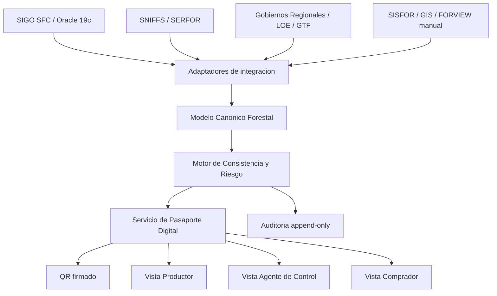
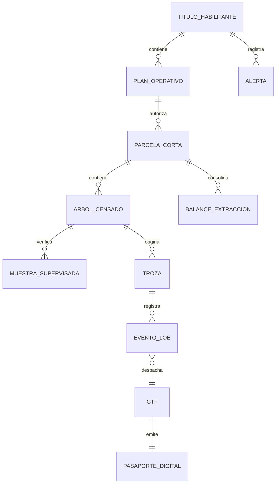

# SPEC.md - Pasaporte Digital de Madera Legal OSINFOR

## 1. Resumen ejecutivo y propuesta de valor

### 1.1 Concepto de solucion

El **Pasaporte Digital de Madera Legal** es una capa de integracion semantica y verificacion de confianza que conecta informacion actualmente fragmentada entre OSINFOR, SERFOR, Gobiernos Regionales y los actores de la cadena forestal. La solucion no reemplaza a SIGO SFC, SNIFFS, SISFOR, el Libro de Operaciones Electronico (LOE) ni las Guias de Transporte Forestal (GTF). Su funcion es actuar como una capa interoperable que normaliza evidencias, calcula consistencia y publica una senal verificable de legalidad.

El pasaporte resume, para un arbol, troza, lote o guia de transporte, la evidencia clave de origen legal: identidad forestal, autorizacion, censo, supervision, eventos operativos, volumen movilizado, alertas y estado de confianza. El usuario final accede mediante un QR firmado que abre una vista de verificacion en menos de 3 segundos.

### 1.2 Problema que resuelve

El problema central no es solamente la tala ilegal, sino la falta de **confianza verificable**. El Estado peruano posee datos relevantes, pero estos estan distribuidos en sistemas y momentos distintos:

- SERFOR/SNIFFS administra informacion normativa, derechos y registros forestales.
- OSINFOR/SIGO SFC registra supervision, fiscalizacion, hallazgos y alertas.
- Gobiernos Regionales participan en control local, autorizaciones operativas y transporte.
- LOE y GTF documentan eventos fisicos de aprovechamiento y movilizacion.
- SISFOR y repositorios geoespaciales contienen evidencias de campo.

La solucion integra estas fuentes mediante adaptadores y un modelo canonico, permitiendo que un productor, agente de control o comprador consulte una version consolidada, trazable y auditable de la legalidad de la madera.

### 1.3 Valor publico

El valor publico esperado es reducir verificaciones manuales de 2-5 dias por vehiculo a una consulta digital de **menos de 3 segundos** en condiciones normales de conectividad. Esto permite:

- Reducir friccion logistica en puestos de control.
- Diferenciar al productor forestal legal.
- Disminuir riesgo reputacional y legal para compradores nacionales e internacionales.
- Visibilizar el manejo forestal responsable.
- Convertir informacion estatal existente en una senal publica de confianza.

### 1.4 Principio arquitectonico

La solucion se disena como **capa de confianza**, no como sistema transaccional maestro. Cada sistema fuente mantiene su autoridad institucional. El Pasaporte Digital consolida evidencias, conserva linaje de datos, calcula un semaforo explicable y registra auditoria criptografica.

No se propone blockchain para la primera version. La alternativa recomendada es mas viable para el Estado: integridad con hashes SHA-256, tokens QR firmados, auditoria append-only, control de versiones de reglas y consistencia transaccional en base relacional.

---

## 2. Logica de negocio y trazabilidad del activo digital

### 2.1 Identidad oficial: COD_ARBOL

La especificacion adopta **COD_ARBOL como llave universal oficial de negocio del activo forestal**, tal como establece el desafio. Este identificador acompana al arbol desde el censo forestal hasta la tala, trozado, despacho, transporte y verificacion.

La arquitectura puede usar identificadores tecnicos internos para estabilidad transaccional, URLs, QR, auditoria o seguridad, pero estos no reemplazan ni compiten con COD_ARBOL. En el modelo conceptual:

- `COD_ARBOL` es la identidad forestal oficial y visible.
- `arbol_id` o `id_interno` es opcional como llave tecnica de base de datos.
- `passport_id` identifica el documento digital emitido.
- El QR apunta al pasaporte, pero la trazabilidad se explica siempre desde `COD_ARBOL`.

Esta decision evita ambiguedad: la solucion respeta la semantica del sector forestal y no inventa una identidad paralela para el arbol.

### 2.2 Ciclo de vida del COD_ARBOL

El ciclo de vida del activo se modela como una secuencia de estados y eventos:

1. **Censo forestal**
   - Se registra `COD_ARBOL`, especie, coordenadas UTM, DAP, altura, parcela de corta y volumen estimado/autorizado.
   - Esta es la identidad de origen del activo.

2. **Plan operativo y autorizacion**
   - El arbol queda asociado a un titulo habilitante, POA y parcela de corta.
   - El sistema valida que el arbol pertenezca al universo autorizado.

3. **Supervision OSINFOR**
   - La muestra supervisada compara lo declarado contra la verdad de campo.
   - Puede confirmar existencia, detectar desviacion GPS, marcar inexistencia o asociar hallazgos.

4. **Tala**
   - El LOE registra el aprovechamiento del arbol.
   - La solucion verifica que el `COD_ARBOL` exista y este autorizado.

5. **Trozado**
   - El arbol se subdivide en trozas: por ejemplo `100-A`, `100-B`, `100-C`.
   - Cada troza conserva referencia directa al `COD_ARBOL` padre.

6. **Despacho**
   - Las trozas se agrupan en un lote de despacho.
   - Se valida especie, volumen acumulado y consistencia con LOE.

7. **GTF y transporte**
   - La Guia de Transporte Forestal vincula lote, volumen, especie, ruta y documento de movilizacion.
   - El QR del pasaporte se emite sobre el lote/GTF, manteniendo evidencia de los `COD_ARBOL` incluidos.

8. **Verificacion**
   - Agentes de control y compradores consultan el pasaporte.
   - La vista muestra semaforo, evidencias, trazabilidad y estado de vigencia.

### 2.3 Rol de la muestra supervisada

La **Muestra Supervisada de OSINFOR** funciona como validador de verdad de campo. No todo arbol necesariamente tendra supervision directa, pero cuando existe, su peso en el motor de confianza es alto.

La muestra permite comparar:

- Arbol declarado vs. arbol verificado.
- Coordenadas UTM declaradas vs. coordenadas observadas.
- Especie declarada vs. especie verificada.
- Estado: conforme, inexistente, no ubicado, observado u otro estado institucional.
- Evidencia geoespacial y archivos de supervision.

En el semaforo, una muestra conforme fortalece la confianza. Una muestra inexistente o inconsistente puede llevar directamente a Rojo.

### 2.4 Activo digital y pasaporte

El activo digital no es solo una fila de base de datos. Es una representacion verificable de la cadena de custodia:

```text
COD_ARBOL -> Trozas -> Evento LOE -> Despacho -> GTF -> Pasaporte Digital -> QR
```

El pasaporte contiene:

- Identidad del activo o lote.
- Lista de `COD_ARBOL` y trozas asociadas, cuando aplique.
- Estado del motor de confianza.
- Evidencias consultadas.
- Hash de integridad.
- Version de reglas.
- Fecha de emision y ultima evaluacion.
- Estado: vigente, observado, revocado o expirado.

---

## 3. Arquitectura tecnica detallada

### 3.1 Vision por capas



### 3.2 Capa de integracion: adaptadores

Los adaptadores son servicios read-only o de sincronizacion controlada. No modifican los sistemas fuente. Su funcion es extraer, normalizar y registrar linaje.

#### 3.2.1 Oracle Adapter

Responsable de conectarse a fuentes Oracle 19c asociadas a SIGO SFC y estructuras OSINFOR.

Funciones:

- Lectura programada de tablas o vistas autorizadas.
- Normalizacion hacia el modelo canonico.
- Registro de fecha de extraccion, origen y version.
- Manejo de errores de conexion y reintentos.

Tablas candidatas del prompt:

- `DOC_OSINFOR_ERP_MIGRACION.THABILITANTE`
- `DOC_OSINFOR_ERP_MIGRACION.POA_DET_MADERABLE_CENSO`
- `HERR_OSINFOR_ERP_MIGRACION.ALERTAS`
- `DOC_OSINFOR_ERP_MIGRACION.BITACORA_SUPERVISIONES_DET_INFOGEO`

#### 3.2.2 SOAP/REST Adapter

Responsable de consumir servicios .NET existentes, sean SOAP o REST.

Funciones:

- Encapsular diferencias entre protocolos.
- Convertir XML/SOAP o JSON/REST a objetos canonicos.
- Aplicar validacion de esquema.
- Registrar trazabilidad de cada payload consumido.

#### 3.2.3 LOE/GTF Adapter

Responsable de procesar informacion del Libro de Operaciones Electronico y Guias de Transporte Forestal.

Funciones:

- Ingestar eventos de tala, trozado y despacho.
- Asociar trozas al `COD_ARBOL` padre.
- Asociar lote despachado a GTF.
- Validar consistencia minima antes de emitir pasaporte.

#### 3.2.4 GIS Adapter

Responsable de integrar evidencia geoespacial disponible.

Funciones:

- Normalizar coordenadas UTM.
- Vincular arboles a parcelas de corta.
- Integrar tracks o archivos de supervision.
- Preparar compatibilidad futura con servicios ArcGIS, WMS/WFS o capas institucionales cuando existan.

Restriccion importante: el prototipo no consumira capas restringidas reales ni servicios estatales cerrados. Usara datos geoespaciales sinteticos o anonimizados.

#### 3.2.5 Excel Adapter

Responsable de cargar los datos artificiales del prototipo desde archivos Excel (`.xlsx`). En la primera version, este adaptador reemplaza a las conexiones reales con Oracle, SOAP/REST, LOE y GTF, permitiendo demostrar el flujo completo sin intervenir sistemas del Estado.

Funciones:

- Leer uno o varios archivos `.xlsx` desde una carpeta controlada, por ejemplo `/data`.
- Interpretar cada hoja como una fuente simulada: titulos habilitantes, censo, supervision, LOE, GTF, alertas y balances.
- Validar columnas obligatorias antes de cargar datos.
- Mapear columnas Excel hacia el modelo canonico.
- Registrar errores de carga por fila y por hoja.
- Conservar `fuente_origen = EXCEL_SINTETICO` y hash del archivo cargado.

Modalidad recomendada para hackaton:

- **Carga inicial por archivo**: el backend lee los Excel al iniciar o mediante comando administrativo.
- **Carga desde interfaz** queda como mejora posterior si el tiempo alcanza.

Este adaptador debe tratar el Excel como una exportacion simulada de sistemas oficiales, no como un formato final de produccion.

#### 3.2.6 Earth Engine / FORVIEW Evidence Adapter opcional

El prompt menciona que OSINFOR usa FORVIEW sobre Google Earth Engine para descargar imagenes Sentinel y Landsat, y que la revision satelital actual es manual. Por ello, la arquitectura contempla un adaptador opcional de evidencia geoespacial basado en **Google Earth Engine**, no en el antiguo concepto generico de "Google Earth API".

Uso propuesto:

- Consultar imagenes publicas Sentinel/Landsat mediante Google Earth Engine.
- Generar indicadores de apoyo como NDVI, cambios de cobertura, composiciones temporales o evidencia visual alrededor de una parcela.
- Adjuntar capturas, fechas o metricas como evidencia auxiliar del pasaporte.
- Ayudar al analista o jurado a entender el contexto espacial.

Restricciones:

- No decide por si solo si una madera es legal o ilegal.
- No reemplaza a `COD_ARBOL`, censo, LOE, GTF, balance, muestra supervisada ni alertas OSINFOR.
- No debe ser dependencia critica del QR ni del tiempo objetivo de menos de 3 segundos.
- No debe consumir capas restringidas de titulos habilitantes si no existe autorizacion.
- En el prototipo puede omitirse o simularse si no hay credenciales, cuota o conectividad.

En la v1, Google Earth Engine es una fuente de **evidencia complementaria**, no la fuente de verdad legal.

### 3.3 Servicios internos

#### 3.3.1 Canonical Data Service

Gestiona el modelo canonico forestal. Es el centro semantico de la solucion.

Responsabilidades:

- Mantener entidades normalizadas.
- Resolver relaciones entre titulo, POA, parcela, arbol, troza, LOE, GTF y supervision.
- Preservar linaje hacia la fuente original.
- Exponer datos limpios al motor de consistencia.

#### 3.3.2 Consistency Engine

Calcula riesgo y confianza.

Responsabilidades:

- Ejecutar reglas deterministicas.
- Calcular semaforo Verde/Amarillo/Rojo.
- Generar razones explicables.
- Guardar version de reglas aplicada.
- Producir evidencia auditable.

#### 3.3.3 Passport Service

Emite, consulta y revoca pasaportes digitales.

Responsabilidades:

- Crear pasaporte al validar despacho/GTF.
- Generar token QR firmado.
- Publicar vista de confianza.
- Recalcular estado si cambian datos o reglas.
- Revocar pasaportes por alerta, error o decision institucional.

#### 3.3.4 Audit Service

Registra eventos criticos en una bitacora append-only.

Eventos auditables:

- Ingesta de fuente.
- Evaluacion de semaforo.
- Emision de pasaporte.
- Consulta por agente autenticado.
- Revocacion.
- Cambio de reglas.
- Error de integracion.

Cada evento incluye hash del evento anterior para detectar alteraciones.

---

## 4. Modelo de datos

### 4.1 Principios de modelado

El modelo de datos se basa en los datasets y tablas mencionados en el prompt. Es un modelo canonico, no una copia literal de SIGO SFC o SNIFFS.

Principios:

- `COD_ARBOL` es la llave universal de negocio del arbol.
- Toda entidad conserva referencia a la fuente original.
- Los eventos operativos son historicos, no se sobrescriben.
- Las evidencias tienen hash de integridad.
- La vista publica minimiza datos sensibles.
- Las reglas del semaforo son versionadas.

### 4.2 Entidades principales

#### 4.2.1 titulo_habilitante

Basada en `DOC_OSINFOR_ERP_MIGRACION.THABILITANTE`.

Campos conceptuales:

- `titulo_habilitante_id`
- `codigo_titulo`
- `tipo_titulo`
- `region`
- `estado`
- `fecha_inicio`
- `fecha_fin`
- `fuente_origen`
- `fecha_sincronizacion`

Funcion: representar el derecho otorgado para aprovechamiento forestal.

#### 4.2.2 plan_operativo

Representa el POA o plan de manejo operativo.

Campos conceptuales:

- `plan_operativo_id`
- `titulo_habilitante_id`
- `codigo_poa`
- `periodo_inicio`
- `periodo_fin`
- `estado_aprobacion`
- `volumen_total_autorizado_m3`
- `fuente_origen`

Funcion: agrupar autorizaciones por periodo y titulo.

#### 4.2.3 parcela_corta

Representa la unidad espacial autorizada.

Campos conceptuales:

- `parcela_corta_id`
- `plan_operativo_id`
- `codigo_pc`
- `area_ha`
- `geometria`
- `volumen_autorizado_m3`
- `estado`

Funcion: validar pertenencia espacial, volumen y balance por area autorizada.

#### 4.2.4 arbol_censado

Basada en `DOC_OSINFOR_ERP_MIGRACION.POA_DET_MADERABLE_CENSO`.

Campos conceptuales:

- `cod_arbol` como llave universal de negocio.
- `arbol_id` opcional como llave tecnica interna.
- `parcela_corta_id`
- `especie_declarada`
- `coordenada_utm_este`
- `coordenada_utm_norte`
- `dap_cm`
- `altura_m`
- `volumen_estimado_m3`
- `estado_censal`
- `fuente_origen`

Funcion: ser el punto de origen de la trazabilidad.

#### 4.2.5 muestra_supervisada

Basada en datos de supervision OSINFOR y SISFOR.

Campos conceptuales:

- `muestra_id`
- `cod_arbol`
- `supervision_id`
- `estado_supervision`
- `especie_verificada`
- `utm_este_verificado`
- `utm_norte_verificado`
- `desviacion_metros`
- `fecha_supervision`
- `evidencia_hash`
- `archivo_geomatica_ref`

Funcion: actuar como verdad de campo.

#### 4.2.6 troza

Representa la subdivision fisica del arbol.

Campos conceptuales:

- `troza_id`
- `codigo_troza`, por ejemplo `100-A`.
- `cod_arbol` padre.
- `especie`
- `volumen_m3`
- `longitud_m`
- `diametro_promedio_cm`
- `estado`

Funcion: mantener continuidad entre arbol censado y producto movilizado.

#### 4.2.7 evento_loe

Representa eventos del Libro de Operaciones Electronico.

Campos conceptuales:

- `evento_loe_id`
- `tipo_evento`: tala, trozado, despacho.
- `cod_arbol`
- `troza_id`
- `fecha_evento`
- `volumen_evento_m3`
- `usuario_origen_anonimizado`
- `fuente_origen`
- `payload_hash`

Funcion: registrar el flujo operativo sin perder trazabilidad.

#### 4.2.8 gtf

Representa la Guia de Transporte Forestal.

Campos conceptuales:

- `gtf_id`
- `numero_gtf`
- `fecha_emision`
- `fecha_vencimiento`
- `origen`
- `destino`
- `volumen_total_m3`
- `estado_gtf`
- `lote_id`
- `payload_hash`

Funcion: soportar control en ruta y emision del pasaporte.

#### 4.2.9 balance_extraccion

Representa autorizacion vs. movilizacion.

Campos conceptuales:

- `balance_id`
- `plan_operativo_id`
- `parcela_corta_id`
- `especie`
- `volumen_autorizado_m3`
- `volumen_movilizado_m3`
- `volumen_disponible_m3`
- `fecha_corte`

Funcion: detectar sobreextraccion o agotamiento de saldos.

#### 4.2.10 alerta

Basada en `HERR_OSINFOR_ERP_MIGRACION.ALERTAS`.

Campos conceptuales:

- `alerta_id`
- `ambito`: titulo, POA, parcela, arbol, lote, GTF.
- `referencia_id`
- `tipo_alerta`
- `severidad`
- `estado_alerta`
- `fecha_alerta`
- `descripcion_normalizada`

Funcion: incorporar riesgo institucional conocido.

#### 4.2.11 pasaporte_digital

Entidad nueva de la solucion.

Campos conceptuales:

- `passport_id`
- `gtf_id`
- `lote_id`
- `estado_pasaporte`: vigente, observado, revocado, expirado.
- `semaforo`: Verde, Amarillo, Rojo.
- `score_confianza`
- `razones_json`
- `evidencias_json`
- `hash_integridad`
- `qr_token_hash`
- `version_reglas`
- `fecha_emision`
- `fecha_ultima_evaluacion`

Funcion: materializar la confianza verificable.

### 4.3 Diagrama entidad-relacion conceptual



### 4.4 Consideracion sobre llaves

El diseno recomendado distingue entre llaves de negocio y llaves tecnicas:

- Llave de negocio principal: `COD_ARBOL`.
- Llaves tecnicas opcionales: `arbol_id`, `passport_id`, `lote_id`, `gtf_id`.
- Restriccion obligatoria: ningun registro de troza, evento LOE o evidencia de arbol debe perder referencia al `COD_ARBOL`.

Esto permite respetar el lenguaje institucional y al mismo tiempo operar APIs, URLs, auditoria y tokens QR de forma segura.

---

## 5. Motor de consistencia: el semaforo

### 5.1 Objetivo

El motor de consistencia transforma evidencia fragmentada en una decision explicable de riesgo. No es una IA opaca ni una prediccion probabilistica. Es un motor deterministico de reglas versionadas.

Cada evaluacion produce:

- Semaforo: Verde, Amarillo o Rojo.
- Score numerico de confianza.
- Reglas activadas.
- Evidencias utilizadas.
- Fecha de evaluacion.
- Version del motor.
- Hash de integridad.

### 5.2 Grupos de reglas

#### 5.2.1 Reglas de identidad

Verifican que el activo exista y mantenga continuidad.

- `COD_ARBOL` debe existir en censo forestal autorizado.
- La troza debe derivar de un `COD_ARBOL` valido.
- La GTF debe asociarse a lote con trozas identificables.
- No debe existir contradiccion entre codigos de arbol, troza y LOE.

#### 5.2.2 Reglas de especie

Verifican consistencia taxonomica.

- Especie censada debe coincidir con especie LOE.
- Especie LOE debe coincidir con especie GTF.
- Si existe muestra supervisada, especie verificada debe coincidir o explicar diferencia.

#### 5.2.3 Reglas de volumen

Verifican balance fisico.

- Volumen de trozas no debe exceder volumen estimado/autorizado del arbol mas tolerancia tecnica.
- Volumen movilizado por parcela no debe exceder volumen autorizado.
- Volumen GTF debe coincidir con suma de trozas/lote.
- Volumen acumulado debe descontarse del balance de extraccion.

#### 5.2.4 Reglas geoespaciales

Verifican ubicacion.

- Coordenada UTM del arbol debe caer dentro de la parcela de corta autorizada.
- Desviacion entre coordenada declarada y verificada debe estar dentro de umbral.
- Si la coordenada cae fuera del area autorizada, el riesgo sube a Rojo salvo correccion institucional documentada.

#### 5.2.5 Reglas de supervision

Incorporan verdad de campo.

- Muestra conforme suma confianza.
- Arbol inexistente o no conforme puede producir Rojo.
- Ausencia de muestra directa no produce Rojo por si sola; puede producir Amarillo si faltan otras evidencias.

#### 5.2.6 Reglas de alertas

Incorporan hechos irregulares.

- Alerta critica vigente sobre titulo, POA, parcela, arbol, lote o GTF produce Rojo.
- Alerta media produce Amarillo o Rojo segun severidad y relacion directa.
- Alerta cerrada se conserva como antecedente, pero no necesariamente bloquea.

#### 5.2.7 Reglas de documento y QR

Verifican validez de la consulta.

- GTF debe estar vigente.
- QR debe estar firmado y no revocado.
- Pasaporte no debe estar expirado.
- Token no debe haber sido manipulado.

### 5.3 Criterios del semaforo

#### Verde

Se asigna Verde cuando:

- `COD_ARBOL` existe en censo autorizado.
- Especie coincide entre censo, LOE, trozas y GTF.
- Volumen no excede autorizado ni balance disponible.
- Ubicacion es consistente con parcela de corta.
- No hay alertas criticas vigentes.
- GTF y QR estan vigentes.
- La evidencia disponible no presenta contradicciones.

#### Amarillo

Se asigna Amarillo cuando:

- Falta muestra OSINFOR directa, pero no hay contradiccion.
- Existe sincronizacion pendiente de una fuente.
- La desviacion GPS es moderada.
- El volumen esta cerca del limite autorizado.
- Hay alerta leve o dato incompleto.
- La evidencia permite transporte, pero recomienda revision.

#### Rojo

Se asigna Rojo cuando:

- `COD_ARBOL` no existe en censo autorizado.
- Arbol figura como inexistente o no conforme.
- Especie no coincide sin justificacion.
- Volumen excede umbral critico.
- GTF esta vencida, duplicada, revocada o no encontrada.
- Ubicacion cae fuera de area autorizada.
- Existe alerta critica vigente.
- QR o hash de integridad no valida.

### 5.4 Hashing e integridad

Cada pasaporte calcula un hash de integridad sobre:

- Identificadores del lote/GTF.
- Lista de `COD_ARBOL` incluidos.
- Volumen y especie declarados.
- Evidencias usadas.
- Resultado del semaforo.
- Version de reglas.
- Timestamp de evaluacion.

La auditoria append-only encadena hashes entre eventos. Esto no impide por si solo una modificacion maliciosa, pero permite detectarla y reconstruir la historia.

---

## 6. Experiencia de usuario y journeys

### 6.1 Productor forestal

Objetivo: diferenciar madera legal y reducir dependencia de certificaciones privadas costosas.

Flujo:

1. El productor registra o confirma eventos en LOE.
2. El sistema detecta despacho y GTF asociada.
3. El motor valida `COD_ARBOL`, trozas, especie, volumen y balance.
4. Se emite pasaporte digital si no hay bloqueo rojo.
5. El productor descarga o imprime QR.
6. El QR acompana lote/documentacion durante transporte y comercializacion.

Vista esperada:

- Estado del lote.
- Semaforo.
- Volumen legal acreditado.
- Lista de especies.
- Fecha de emision.
- QR.
- Mensajes claros de observacion si hay Amarillo o Rojo.

### 6.2 Agente de control

Objetivo: verificar en ruta sin esperar cruces manuales de varios dias.

Flujo:

1. Agente escanea QR.
2. Sistema valida firma del token.
3. API consulta pasaporte vigente.
4. Motor devuelve semaforo y razones.
5. Agente revisa GTF, lote, especies, volumen, alertas e historial de supervision.
6. Si Rojo, se recomienda accion de control segun protocolo institucional.

Vista esperada:

- Semaforo muy visible.
- Numero de GTF.
- Estado del pasaporte.
- Volumen total.
- Especies.
- Alertas.
- Evidencia OSINFOR resumida.
- Boton o accion de registro de verificacion.

### 6.3 Comprador internacional

Objetivo: reducir riesgo legal y reputacional al comprar madera peruana.

Flujo:

1. Comprador escanea QR o abre enlace.
2. Accede a vista publica de confianza.
3. Visualiza origen legal, trazabilidad resumida y evidencia no sensible.
4. Descarga o consulta constancia digital.

Vista esperada:

- Estado de confianza.
- Pais, region y tipo de origen.
- Especie y volumen.
- Evidencia de manejo responsable.
- Fecha de ultima verificacion.
- Hash de integridad.
- Disclaimer sobre alcance del prototipo.

No debe ver datos personales sensibles de titulares, funcionarios o comunidades, salvo informacion expresamente autorizada para publicacion.

### 6.4 Administrador OSINFOR

Objetivo: controlar reglas, auditoria, fuentes y revocaciones.

Flujo:

1. Accede con autenticacion institucional.
2. Revisa sincronizacion de fuentes.
3. Consulta pasaportes emitidos.
4. Audita reglas activadas.
5. Revoca o marca observado un pasaporte si aparece nueva evidencia.
6. Publica nueva version de reglas bajo control de cambios.

---

## 7. APIs e interfaces

### 7.1 API publica de verificacion

#### GET /verify/{qr_token}

Uso: abrir vista publica desde QR.

Respuesta conceptual:

- Estado del pasaporte.
- Semaforo.
- GTF asociada.
- Especies.
- Volumen.
- Evidencias resumidas.
- Hash de integridad.
- Fecha de ultima evaluacion.

Restricciones:

- No exponer datos personales.
- Aplicar rate limiting.
- No revelar payload interno completo del QR.

### 7.2 API interna de pasaportes

#### GET /v1/passports/{passport_id}

Uso: consulta estructurada para usuarios autenticados.

Incluye:

- Detalle completo del pasaporte.
- Reglas activadas.
- Evidencias.
- Historial de cambios.

#### POST /v1/passports/issue

Uso: emitir pasaporte luego de validacion LOE/GTF.

Entrada conceptual:

- `gtf_id`
- `lote_id`
- Lista de trozas o eventos de despacho.

Salida:

- `passport_id`
- `qr_token`
- Semaforo inicial.

#### POST /v1/passports/{passport_id}/revoke

Uso: revocar por alerta, error, actualizacion o decision institucional.

Entrada conceptual:

- Motivo.
- Usuario responsable.
- Evidencia.

### 7.3 API del motor de consistencia

#### POST /v1/consistency/evaluate

Uso: evaluar arbol, troza, lote o GTF.

Salida:

- Semaforo.
- Score.
- Razones.
- Evidencias.
- Version de reglas.

#### GET /v1/gtf/{gtf_id}/trust

Uso: consulta rapida por agente de control.

Salida:

- Estado GTF.
- Estado pasaporte.
- Semaforo.
- Alertas.
- Resumen de trazabilidad.

### 7.4 Contratos de interoperabilidad

Las APIs deben documentarse con OpenAPI y usar JSON sobre HTTPS. Para integracion futura con PIDE, se recomienda:

- Versionamiento `/v1`.
- IDs institucionales estables.
- Esquemas JSON documentados.
- Registro de auditoria de consumo.
- Separacion de APIs publicas e internas.
- Preparacion para autenticacion federada estatal.

---

## 8. Tech stack

### 8.1 Backend

**FastAPI / Python**

Uso:

- APIs REST.
- Adaptadores.
- Motor de reglas.
- Emision y verificacion de QR.
- Jobs de sincronizacion.

Justificacion:

- Adecuado para servicios REST y documentacion OpenAPI.
- Despliegue simple en contenedores Linux.
- Buen ecosistema para integracion con bases de datos, geodatos, firmas y procesamiento de datos.
- Facil de mantener por equipos universitarios y transferible al Estado.

### 8.2 Frontend

**React web responsive / PWA**

Uso:

- Vista productor.
- Vista agente de control.
- Vista comprador.
- Panel administrador.

Justificacion:

- Permite una sola aplicacion responsive para escritorio y movil.
- Evita publicar app nativa en tiendas durante prototipo.
- Facilita accesibilidad WCAG 2.1 AA.
- Puede evolucionar luego a app movil oficial si OSINFOR lo requiere.

### 8.3 Base de datos

**PostgreSQL + PostGIS**

Uso:

- Modelo canonico relacional.
- Transacciones.
- Auditoria.
- Coordenadas UTM y validaciones espaciales.
- Consultas por parcela, region, POA y GTF.

Justificacion:

- PostgreSQL ofrece integridad transaccional, claves, indices y concurrencia.
- PostGIS permite almacenar geometria y ejecutar validaciones espaciales.
- Stack open source y reutilizable por el Estado.

### 8.4 Infraestructura

**Docker Compose para prototipo**

Servicios esperados:

- API backend.
- Frontend web.
- PostgreSQL/PostGIS.
- Servicio de jobs/adaptadores.
- Proxy reverso opcional.

Ruta futura:

- Red Hat Linux.
- Podman o Docker compatible.
- OpenShift o Kubernetes si se requiere orquestacion institucional.
- Integracion con IIS/.NET existente mediante APIs o reverse proxy.

### 8.5 Seguridad

Componentes:

- TLS en todas las comunicaciones.
- OAuth2/OIDC para usuarios internos.
- RBAC por rol: productor, agente, comprador publico, administrador.
- QR firmado con JWS o HMAC-SHA-256.
- Hash SHA-256 para evidencias.
- Cifrado en reposo para datos sensibles.
- Secret management por variables seguras o vault institucional.
- Rate limiting y proteccion anti-enumeracion.

### 8.6 Licenciamiento

Recomendacion:

- Codigo: Apache-2.0 o MIT.
- Documentacion: CC BY 4.0.
- Datos sinteticos: CC0 o licencia equivalente.

Apache-2.0 es preferible si se desea mayor claridad sobre patentes y reutilizacion institucional.

---

## 9. Seguridad, privacidad y cumplimiento

### 9.1 Ley 29733

El prototipo debe evitar datos personales reales. La estrategia sera:

- Usar datos sinteticos o anonimizados.
- No publicar nombres de personas naturales.
- Minimizar datos de titulares y funcionarios.
- Separar vista publica de vista interna.
- Registrar finalidad de uso de cada dato.
- Evitar exposicion de coordenadas sensibles si la fuente es restringida.

### 9.2 SGSI / ISO 27001

Diseno bajo seguridad por defecto:

- Principio de menor privilegio.
- Roles y permisos separados.
- Bitacora de accesos.
- Trazabilidad de cambios.
- Integridad de evidencia.
- Gestion segura de secretos.
- Separacion entre datos sinteticos de demo y datos reales futuros.

### 9.3 DL 1412 e interoperabilidad estatal

La arquitectura se alinea con gobierno digital al priorizar:

- Servicios digitales interoperables.
- Seguridad digital.
- Gestion de datos.
- Arquitectura digital reutilizable.
- APIs documentadas para futura integracion PIDE.

### 9.4 Accesibilidad e identidad visual

La interfaz debe cumplir:

- Espanol como idioma base.
- WCAG 2.1 AA como objetivo.
- Contraste suficiente.
- Navegacion por teclado.
- Componentes claros para semaforo sin depender solo del color.
- Preparacion futura para lenguas originarias.
- Alineamiento visual con el Manual de Identidad Visual de OSINFOR.

---

## 10. Estrategia de prototipo y datos sinteticos

### 10.1 Fuente de datos del prototipo: Excel sintetico

Los datos artificiales del prototipo se manejaran como archivos Excel (`.xlsx`). Estos archivos representan exportaciones simuladas de las fuentes institucionales, por lo que el sistema no se conectara inicialmente a SIGO SFC, SNIFFS, LOE real, GTF real ni servicios restringidos.

Flujo de carga:

```text
Excel sintetico
    -> Excel Adapter
    -> validacion de columnas y tipos
    -> modelo canonico PostgreSQL/PostGIS
    -> motor de consistencia
    -> pasaporte digital y QR
```

Estructura recomendada:

| Excel u hoja | Entidad canonica destino | Contenido esperado |
|---|---|---|
| `titulos_habilitantes` | `titulo_habilitante` | derechos otorgados, region, estado, vigencia |
| `planes_operativos` | `plan_operativo` | POA, periodo, estado, volumen autorizado |
| `parcelas_corta` | `parcela_corta` | codigo PC, area, geometria o coordenadas sinteticas |
| `censo_forestal` | `arbol_censado` | `COD_ARBOL`, especie, UTM, DAP, altura, volumen |
| `muestra_supervisada` | `muestra_supervisada` | estado OSINFOR, desviacion, especie verificada, evidencia |
| `loe_tala` | `evento_loe` | eventos de tala por `COD_ARBOL` |
| `loe_trozado` | `troza` y `evento_loe` | trozas como `100-A`, `100-B`, volumen y dimensiones |
| `loe_despacho` | `evento_loe` | salida de trozas hacia lote/GTF |
| `gtf` | `gtf` | guia, fechas, lote, origen, destino, volumen |
| `balance_extraccion` | `balance_extraccion` | autorizado, movilizado y disponible |
| `alertas` | `alerta` | hechos irregulares, severidad y estado |

Reglas de carga:

- `COD_ARBOL` debe estar presente en todo archivo que trate arboles, trozas o eventos LOE.
- Las trozas deben conservar el codigo del arbol padre.
- Cada hoja debe declarar una fuente logica, fecha de corte y version del dataset.
- La carga debe fallar de forma controlada si faltan columnas obligatorias.
- La carga debe registrar un hash del archivo Excel para trazabilidad.
- Los datos cargados desde Excel se consideran fuente principal del prototipo.

### 10.2 Politica de APIs externas publicas

Las APIs externas publicas pueden usarse solo como enriquecimiento opcional. No deben ser necesarias para que el prototipo calcule el semaforo ni para que el QR responda en menos de 3 segundos.

Politica:

- **Fuente principal de verdad del prototipo:** Excel sintetico cargado al modelo canonico.
- **Fuentes criticas del semaforo:** censo, LOE, GTF, balance, muestra supervisada y alertas simuladas.
- **APIs externas opcionales:** mapas base, Google Earth Engine, catalogos publicos o capas abiertas.
- **Prohibido en v1:** depender de una API externa para decidir legalidad o bloquear una verificacion QR.

Uso especifico de Google Earth Engine:

- Puede apoyar visualizacion y monitoreo con imagenes Sentinel/Landsat.
- Puede generar evidencia auxiliar de cobertura o cambio temporal.
- Puede servir como demostracion de continuidad futura con FORVIEW.
- No sustituye datos oficiales ni supervision OSINFOR.
- Si no hay credenciales, cuota o conectividad, el prototipo debe seguir funcionando con Excel local.

### 10.3 Caso base

El dataset sintetico se inspirara en el caso Comunidad Nativa Belgica:

- Periodo 2025-2028.
- 3 parcelas de corta.
- 6,790.60 hectareas.
- 7,660 arboles autorizados.
- 48,964.013 m3 autorizados.
- 31,497.891 m3 movilizados al 10/06/2026.

Estos valores se usaran como escala y narrativa, no como datos reales de titulares.

### 10.4 Escenarios de demo

#### Escenario Verde

- `COD_ARBOL` existe.
- Trozas derivan correctamente.
- GTF vigente.
- Volumen dentro del autorizado.
- Sin alertas.
- Resultado: pasaporte Verde.

#### Escenario Amarillo

- `COD_ARBOL` existe.
- No hay muestra supervisada directa.
- Existe pequena desviacion o sincronizacion pendiente.
- Resultado: pasaporte Amarillo.

#### Escenario Rojo

- Troza referencia arbol inexistente o volumen excedido.
- GTF vencida o alerta critica.
- Resultado: pasaporte Rojo.

### 10.5 Entregables de hackaton

- SPEC.md tecnico.
- Prototipo funcional o mockup interactivo.
- Dataset sintetico.
- Presentacion PDF de maximo 10 diapositivas.
- Repositorio open source.
- Guia de despliegue local.

Este archivo cubre el primer entregable tecnico y orienta los demas.

---

## 11. Testing y criterios de aceptacion

### 11.1 Pruebas funcionales

- El sistema emite pasaporte Verde para arbol censado, trozas validas y GTF vigente.
- El sistema devuelve Amarillo cuando falta muestra OSINFOR directa pero no hay contradiccion.
- El sistema devuelve Rojo cuando `COD_ARBOL` no existe.
- El sistema devuelve Rojo cuando la especie no coincide.
- El sistema devuelve Rojo cuando el volumen movilizado excede el autorizado.
- El sistema devuelve Rojo cuando el QR fue manipulado o revocado.
- El sistema conserva referencia entre troza y `COD_ARBOL` padre.

### 11.2 Pruebas no funcionales

- Consulta QR responde en menos de 3 segundos con dataset sintetico representativo.
- Vista publica no expone datos personales.
- Auditoria hash detecta alteraciones.
- API documentada con OpenAPI.
- Contenedores levantan el prototipo en entorno local.
- Interfaz cumple criterios basicos WCAG 2.1 AA.

### 11.3 Pruebas de seguridad

- Token QR invalido no devuelve informacion sensible.
- Usuario sin rol interno no accede a evidencias completas.
- Revocacion invalida pasaporte previamente emitido.
- Rate limiting reduce scraping o enumeracion.
- Logs no almacenan secretos.

### 11.4 Criterios de aceptacion de negocio

- Productor puede generar o visualizar QR asociado a despacho/GTF.
- Agente de control puede verificar estado en ruta.
- Comprador puede acceder a vista publica de confianza.
- Administrador puede auditar razones del semaforo.
- La solucion explica de forma clara por que un lote es Verde, Amarillo o Rojo.

---

## 12. Roadmap de implementacion

### Fase 0 - Preparacion

- Confirmar estructura final del dataset sintetico.
- Definir campos minimos por entidad.
- Definir identidad visual base.
- Definir reglas v1 del semaforo.

### Fase 1 - Modelo canonico y backend

- Crear base PostgreSQL/PostGIS.
- Implementar entidades principales.
- Crear adaptadores simulados.
- Implementar motor de reglas v1.
- Implementar API de pasaportes.

### Fase 2 - QR y experiencia de usuario

- Generar QR firmado.
- Crear vista publica de verificacion.
- Crear vista agente de control.
- Crear vista productor.
- Crear vista comprador.

### Fase 3 - Auditoria y seguridad

- Registrar eventos append-only.
- Implementar revocacion.
- Aplicar RBAC.
- Probar minimizacion de datos.
- Documentar seguridad por diseno.

### Fase 4 - Demo y presentacion

- Preparar tres escenarios: Verde, Amarillo, Rojo.
- Medir tiempo de consulta.
- Crear narrativa de impacto publico.
- Preparar PDF de maximo 10 diapositivas.

---

## 13. Riesgos y mitigaciones

| Riesgo | Impacto | Mitigacion |
|---|---:|---|
| Falta de APIs reales entre SNIFFS y SIGO SFC | Alto | Usar adaptadores desacoplados y datasets sinteticos; preparar contratos PIDE |
| Restriccion de datos geoespaciales | Alto | No exponer capas sensibles; usar geometrias sinteticas o generalizadas |
| Confusion entre pasaporte y certificacion privada | Medio | Presentarlo como senal estatal de confianza, no como FSC |
| Sobreexposicion de datos personales | Alto | Vista publica minimizada y anonimizada |
| Reglas demasiado complejas para demo | Medio | Version v1 deterministica con reglas claras |
| Baja conectividad en ruta | Medio | QR firmado con resumen minimo y revalidacion online cuando exista conexion |
| Cambios institucionales posteriores | Medio | Arquitectura modular y reglas versionadas |

---

## 14. Alineamiento con rubrica

### Calidad - 35%

- Propone integracion semantica, no solo visualizacion.
- Usa `COD_ARBOL` como identidad oficial del activo.
- Convierte datos estatales en confianza verificable.
- Incluye motor explicable Verde/Amarillo/Rojo.

### Prototipo y viabilidad - 30%

- Stack open source y desplegable en contenedores.
- Compatible con Oracle 19c, SOAP/REST, Red Hat Linux y servicios existentes.
- No requiere intervenir sistemas reales.
- Puede demostrarse con datos sinteticos.

### Apertura y etica - 20%

- Nucleo open source.
- Datos sinteticos/anonimizados.
- Privacidad por diseno.
- Auditoria e integridad verificable.

### Presentacion - 15%

- Historia clara: problema, solucion, arquitectura, motor, demo e impacto.
- Diagramas conceptuales incluidos.
- Enfoque comprensible para jurado tecnico y no tecnico.

---

## 15. Supuestos finales

- `COD_ARBOL` es la llave universal oficial de negocio del activo forestal.
- El prototipo no consume sistemas reales del Estado.
- Los datos usados son sinteticos o anonimizados.
- La primera version llega hasta GTF/verificacion QR.
- Transformacion primaria, secundaria y comercializacion quedan como extensiones futuras.
- El pasaporte digital no reemplaza SIGO SFC, SNIFFS, LOE ni GTF.
- La solucion es una capa de confianza interoperable y auditable.

---

## 16. Fuentes tecnicas consultadas

- FastAPI Documentation - Deployment with Docker: https://fastapi.tiangolo.com/deployment/docker/
- React Documentation - Creating a React App: https://react.dev/learn/start-a-new-react-project
- PostgreSQL Documentation - What is PostgreSQL: https://www.postgresql.org/docs/current/intro-whatis.html
- PostGIS Documentation - Official Manual: https://postgis.net/documentation/manual/
- Docker Documentation - Docker Compose: https://docs.docker.com/compose/
- Gobierno del Peru - Decreto Legislativo N. 1412, Ley de Gobierno Digital: https://www.gob.pe/institucion/pcm/normas-legales/289706-1412
- Google Earth Engine Documentation - Get Started: https://developers.google.com/earth-engine/guides/getstarted
- Google Earth Engine Data Catalog - Harmonized Sentinel-2 MSI Level-2A: https://developers.google.com/earth-engine/datasets/catalog/COPERNICUS_S2_SR_HARMONIZED
- Google Earth Engine Data Catalog - USGS Landsat 8 Level 2: https://developers.google.com/earth-engine/datasets/catalog/LANDSAT_LC08_C02_T1_L2
